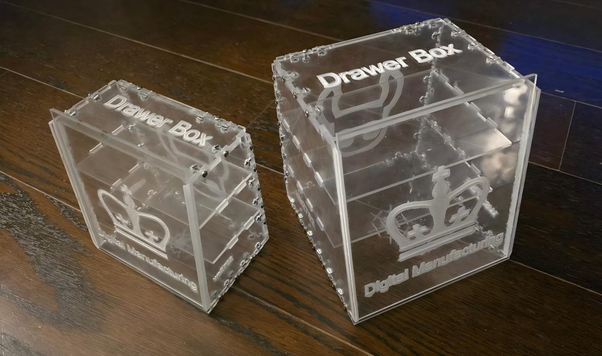
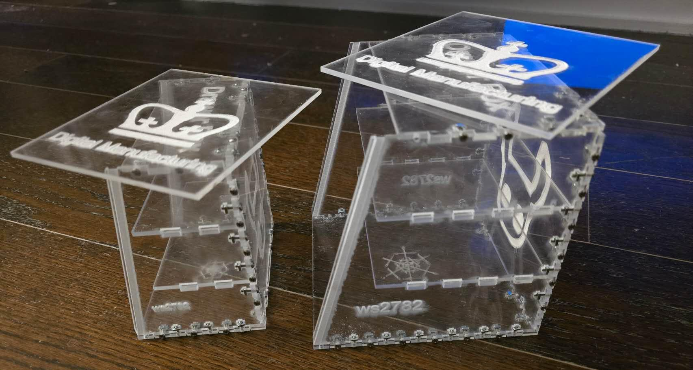
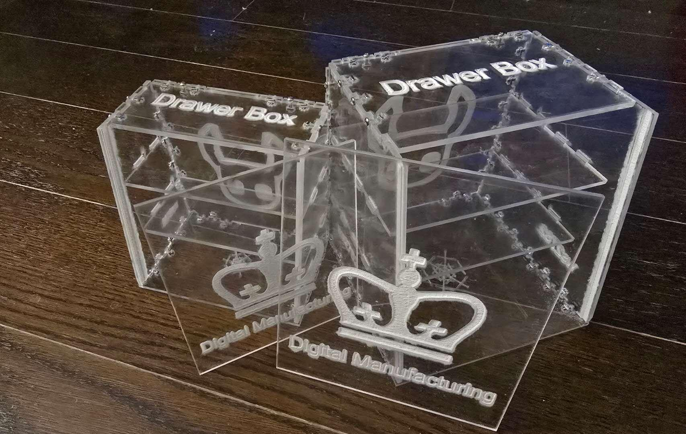
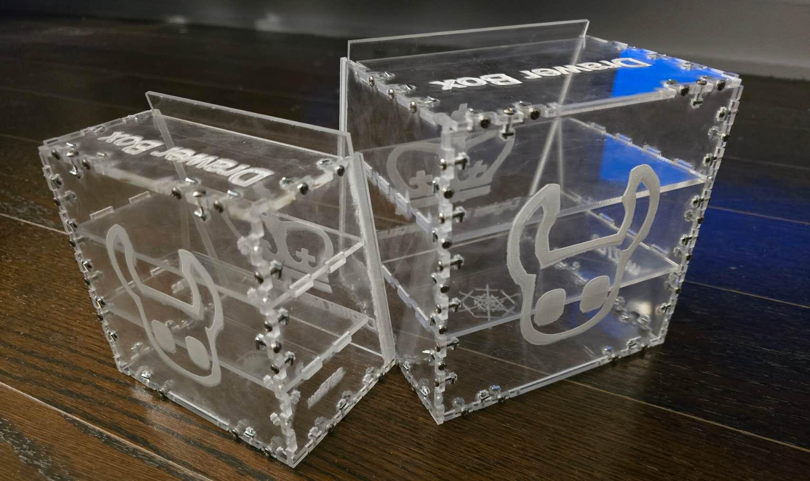

# Parametric Drawer Box Laser-Cut SVG Generator

[English](#english) | [中文](#中文)

---

<a id="english"></a>

## English

A Python-based parametric generator for creating SVG files used to laser-cut a **drawer box** structure.

This project was developed for **MECEE4606 – Digital Manufacturing at Columbia University**. The software automatically generates precise SVG drawings of drawer-box components with assembly notches, screw holes, and decorative patterns, making them ready for **laser cutting or CNC fabrication**.

The design is **fully parametric**, allowing users to change the box dimensions and automatically regenerate all parts.

### Project Overview

The project combines **digital fabrication**, **parametric design**, and **Python-based geometry generation**.

The program:

- generates SVG cutting files for each structural component
- calculates notch geometry for mechanical assembly
- automatically places screw holes and nut slots
- adds optional decorative elements, such as a snowflake pattern and Hollow Knight artwork
- enforces dimensional constraints required for fabrication

All generated files can be used in laser-cutting software such as **LightBurn, Adobe Illustrator, or CorelDRAW**.

### Final Product

Example laser-cut drawer boxes produced using the generated SVG files:






### Features

- parametric drawer-box design
- automatic notch generation for panel assembly
- screw-hole and nut-slot placement
- error detection for invalid dimensions
- decorative vector-pattern generation
- manufacturing-ready SVG output

### Parametric Constraints

The program enforces fabrication constraints to ensure that the box can be manufactured and assembled correctly.

Example limits:

| Parameter | Value |
|---|---:|
| Width | 60 mm < width ≤ 150 mm |
| Height | 60 mm < height ≤ 150 mm |
| Notch height | 4 mm |
| Notch width | 10 mm |
| Screw diameter | 2.3 mm |

These parameters ensure that the joints, screw holes, and assembly slots remain valid for fabrication.

### How It Works

The Python scripts generate SVG geometry through coordinate-based vector drawing.

Core steps:

1. Define input parameters, including box width and height.
2. Compute notch positions and panel edges.
3. Generate screw-hole coordinates.
4. Construct SVG paths using `M`, `L`, and `Z` commands.
5. Export the SVG file for laser cutting.

Example mathematical conversion:

```text
x = center_x + radius × cos(angle)
y = center_y + radius × sin(angle)
```

This enables the procedural generation of decorative elements such as the snowflake pattern.

### Usage

Run the desired Python script and enter the box dimensions.

Example command:

```bash
python "Drawer Box Part1.py"
```

Example input:

```text
Enter rectangle width (millimeters): 100
Enter rectangle height (millimeters): 100
```

Example output:

```text
SVG file 'Drawer Box part1.svg' generated successfully.
```

The generated SVG file can then be opened in compatible laser-cutting software.

### Hardware

The drawer-box panels are assembled using standard machine screws and square nuts. The physical prototype uses:

- [Square Nut, 2-56 thread](https://www.mcmaster.com/products/94855a279/)
- [Pan Head Phillips Machine Screw, 2-56 thread](https://www.mcmaster.com/91772A079/)

Typical specifications:

- Thread size: **2-56**
- Screw material: **18-8 stainless steel**
- Head type: **Phillips pan head**
- Fastening method: square nuts aligned inside laser-cut slots

These components are small enough to fit within the notch geometry while providing reliable fastening for acrylic panels. Square nuts are particularly useful because their flat sides prevent rotation inside square pockets or channels during tightening.

### Manufacturing Process

1. Generate SVG cutting files using the Python scripts.
2. Import the SVG files into laser-cutting software.
3. Cut the panels from acrylic or wood sheets.
4. Assemble the panels using screws and interlocking notches.
5. Install the sliding lid to complete the drawer box.

### Course Information

- Course: **MECEE4606 – Digital Manufacturing**
- Institution: **Columbia University**
- Assignment: **Laser Cut Vessel**

---

<a id="中文"></a>

## 中文

本项目是一个基于 Python 的参数化生成工具，用于创建可供激光切割机加工的**抽屉盒结构 SVG 文件**。

项目完成于哥伦比亚大学课程 **MECEE4606 – Digital Manufacturing（数字制造）**。程序能够自动生成带有装配卡槽、螺丝孔和装饰图案的精确抽屉盒零件图，并可直接用于**激光切割或 CNC 加工**。

整个设计为**全参数化设计**，用户修改盒体尺寸后，程序即可自动重新生成所有零件。

### 项目概述

本项目结合了**数字制造、参数化设计和基于 Python 的几何生成**。

程序可以：

- 为各个结构零件生成 SVG 切割文件
- 计算机械装配所需的卡槽几何尺寸
- 自动布置螺丝孔和方形螺母槽
- 添加雪花图案、空洞骑士图案等可选装饰元素
- 检查并限制影响加工的尺寸参数

生成的文件可直接导入 **LightBurn、Adobe Illustrator 或 CorelDRAW** 等激光切割相关软件。

### 最终成品

以下为使用程序生成的 SVG 文件制作的激光切割抽屉盒：


### 主要功能

- 参数化抽屉盒设计
- 自动生成面板装配卡槽
- 自动布置螺丝孔与螺母槽
- 检测无效尺寸输入
- 生成装饰性矢量图案
- 输出可直接制造的 SVG 文件

### 参数约束

程序会强制执行加工约束，以确保抽屉盒能够正确制造和装配。

示例限制：

| 参数 | 数值 |
|---|---:|
| 宽度 | 60 mm < 宽度 ≤ 150 mm |
| 高度 | 60 mm < 高度 ≤ 150 mm |
| 卡槽高度 | 4 mm |
| 卡槽宽度 | 10 mm |
| 螺丝孔直径 | 2.3 mm |

这些参数可确保连接位置、螺丝孔及装配槽满足实际加工要求。

### 工作原理

Python 脚本通过基于坐标的矢量绘图生成 SVG 几何图形。

主要步骤：

1. 设置盒体宽度和高度等输入参数。
2. 计算卡槽位置与面板边缘。
3. 生成螺丝孔坐标。
4. 使用 `M`、`L` 和 `Z` 命令构建 SVG 路径。
5. 导出可用于激光切割的 SVG 文件。

数学转换示例：

```text
x = center_x + radius × cos(angle)
y = center_y + radius × sin(angle)
```

该方法可用于程序化生成雪花等装饰图案。

### 使用方法

运行所需的 Python 脚本，并输入盒体尺寸。

命令示例：

```bash
python "Drawer Box Part1.py"
```

输入示例：

```text
Enter rectangle width (millimeters): 100
Enter rectangle height (millimeters): 100
```

输出示例：

```text
SVG file 'Drawer Box part1.svg' generated successfully.
```

随后即可使用兼容的激光切割软件打开生成的 SVG 文件。

### 装配硬件

抽屉盒面板使用标准机械螺丝和方形螺母进行装配。实体原型采用：

- [2-56 螺纹方形螺母](https://www.mcmaster.com/products/94855a279/)
- [2-56 螺纹十字盘头机械螺丝](https://www.mcmaster.com/91772A079/)

典型规格：

- 螺纹规格：**2-56**
- 螺丝材料：**18-8 不锈钢**
- 螺丝头类型：**十字盘头**
- 紧固方式：方形螺母定位于激光切割槽内

这些零件尺寸较小，能够安装在卡槽结构中，同时为亚克力面板提供可靠连接。方形螺母的平面侧边还可防止螺母在方形孔槽中随螺丝旋转。

### 制造流程

1. 使用 Python 脚本生成 SVG 切割文件。
2. 将 SVG 文件导入激光切割软件。
3. 使用亚克力板或木板切割各个面板。
4. 通过螺丝和互锁卡槽装配面板。
5. 安装滑动盒盖，完成抽屉盒制作。

### 课程信息

- 课程：**MECEE4606 – Digital Manufacturing（数字制造）**
- 学校：**Columbia University（哥伦比亚大学）**
- 作业：**Laser Cut Vessel**

---

## Author / 作者

Wei Sun  
M.S. Mechanical Engineering, Columbia University  
ws2782@columbia.edu
